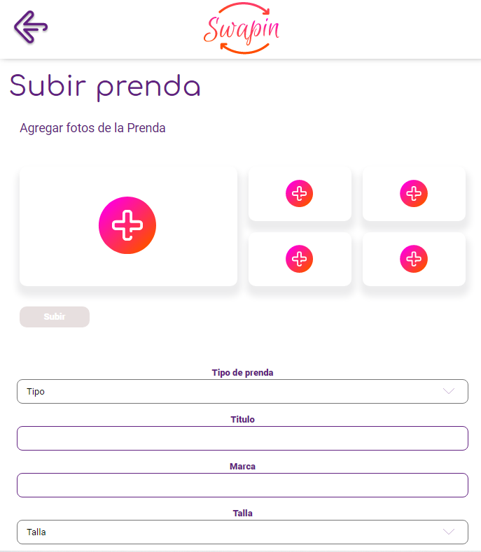

# Swap.in

Swap.in is an app that allows you to find those clothes you are looking for.
You can create an account, upload clothes that you no longer use and want to change with another person in the app.

## Content
This App was made with React for Frontend, and python with Django for the Backend
Also use react router and firebase for the management of routes and clothes pictures
that ara allowed in firebase.
For deployment service we use Vercel in the Frontend and Heroku for the API.

## Visuals

## Demo

If you want to see the demo of this project deployed, you can visit [URL](https://swapin.vercel.app/)

## Contributing
If you want to contribute please fork this project, make changes and make a pull request.
You can visit our documentation for the Code conventions that we use in this project.
[Documentation](https://www.notion.so/Swap-in-bb5de019809b438aab339ea5982e2371)

## Authors

[Natanael León](https://github.com/orgs/Swap-in/people/nthx15)

[Diego Alejandro](https://github.com/orgs/Swap-in/people/alejandro2706)

[Sergio Leal barrera](https://github.com/orgs/Swap-in/people/Sergioleal7)

[Antonio Guerrero](https://github.com/orgs/Swap-in/people/ag94e)

[Edward Martinez](https://github.com/orgs/Swap-in/people/Agoriro)

## License
[MIT](https://choosealicense.com/licenses/mit/)